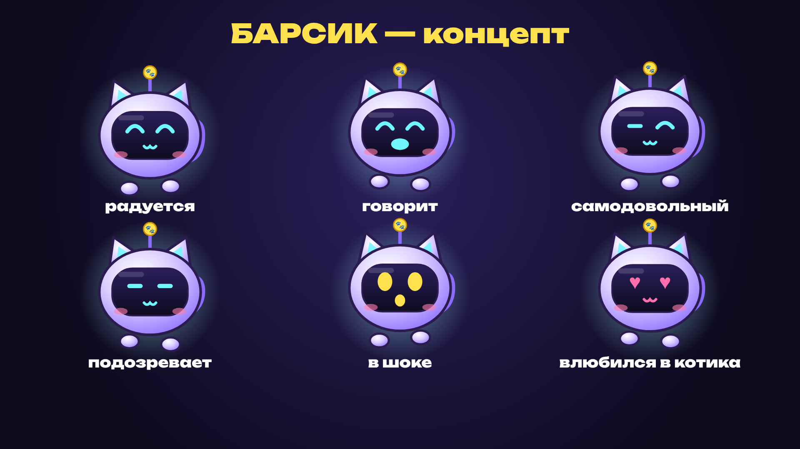

# Барсик — талисман канала

**Кто он:** маленький летающий кот-робот, который живёт в ноутбуке. По лору канала это та самая нейросеть,
голос которой звучит в TikTok. Поэтому в YouTube-выпуске реплика «Вообще-то это был я» работает как отсылка.

**Характер:** уверенный в себе, чуть самовлюблённый, считает себя автором всех игр.
Иногда уверенно говорит ерунду (как настоящая нейросеть), и в этом основной юмор.
Он не злой и не глупый, а скорее самоуверенный стажёр. Любит котиков, потому что сам наполовину котик (вторая половина — калькулятор).
Шутит слегка зловеще, как «добрый» ИИ из фильмов: «удалю тебе систему… шучу, наверное».

**Голос:** тот же, что в TikTok (Piper `denis`). Его не надо узнавать заново, это и есть персонаж.

**Внешность** (оригинальный дизайн, не копия Пикси из Винкс):
- круглая сиреневая голова-шлем с кошачьими ушками, внутри ушей светится бирюзовый;
- тёмный экран-визор, на нём светодиодные глаза и рот, которые меняют эмоции;
- антенна с жёлтой монеткой-лапкой (отсылка к монеткам из игры);
- парит, под ним две «летающие лапки», есть хвост и мягкое свечение с искрами, как у феи.

**Эмоции:** радуется, говорит (рот двигается под голос), самодовольный, подозревает, в шоке, грустит, влюбился в котика.

**Правила использования:**
- 4–8 появлений на YouTube-выпуск, 1–2 короткие фразы за раз. Барсик — приправа, а не второй ведущий.
- Самые сильные места для него: реакции на баги, на деньги и на новых котиков.
- Он может ошибаться и хвастаться, но не должен врать про цифры: честность — главное правило канала.
- В TikTok он может мелькать в углу (1–2 раза за ролик), чтобы люди привыкли к нему до YouTube.

**Как я его анимирую:** реплика озвучивается TTS, рот двигается по громкости голоса, глаза моргают,
тело парит и покачивается, эмоция меняется по разметке в сценарии. При появлении «пуф» с искрами,
при уходе он «сжимается в искру». Нужна статичная камера и точка взгляда (см. `filming-guide.md`).
